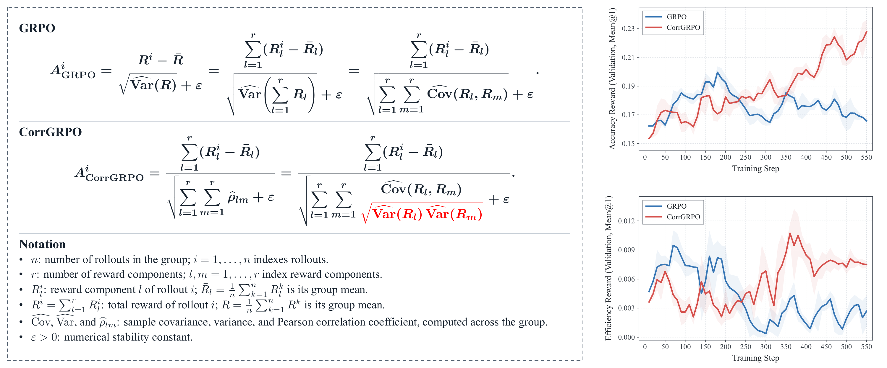
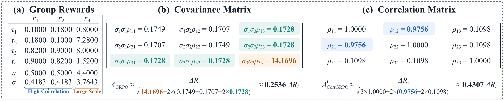

<div align="center">


<h1>CorrGRPO: Correlation-Normalized GRPO for Multi-Reward Learning</h1>

<p>
<a href="https://whuak.github.io/">Wenbin Hu</a><sup></sup>,
  Huihao Jing, 
  Haochen Shi<sup></sup>, 
  Yuxuan Liu<sup></sup>, 
     Haoran Li,
  Yangqiu Song</a><sup></sup>
</p>

<p>
<sup></sup>Hong Kong University of Science and Technology  
</p>

<p>
<sup></sup>whuak@connect.ust.hk
</p>

</div>


<p align="center">
  <a href='https://arxiv.org/abs/2609.36820'>
  
  </a>
  <a href='https://hkust-knowcomp.github.io/CorrGRPO/'>
  
  </a> 
</p>


## Paper Overview


Group Relative Policy Optimization (GRPO) is widely used to train reasoning language models, where it computes advantages by centering and normalizing rewards across rollouts of the same prompt. For multiple rewards, GRPO sums the reward components and normalizes the total reward by its within-group standard deviation. The corresponding variance equals the sum of all pairwise reward covariances. For a fixed centered reward, larger aggregate covariance produces smaller advantages, and vice versa, allowing update magnitudes to adapt to reward dependence. However, correlated rewards with large scales can dominate this normalization and suppress signals from smaller-scale rewards. We propose Correlation-Normalized GRPO (CorrGRPO), which normalizes pairwise covariances into Pearson correlation coefficients. CorrGRPO keeps the centered total reward unchanged while balancing the influence of differently scaled rewards on the correlation-based normalization. This allows advantage magnitudes to adapt to reward correlations without the normalization being dominated by large-scale reward components. We conduct experiments across three domains, including code generation, tool calling, and agent security. 

### Comparison between GRPO and CorrGRPO


<!-- [View vector PDF](corrgrpo-src/assets/figures/figure1.pdf) -->

The left panel shows the change from GRPO to CorrGRPO: replace pairwise covariances in the normalization denominator with Pearson correlations, while keeping the centered reward sum unchanged. The right panels show validation accuracy and efficiency rewards (Mean@1) for Qwen2.5-Coder-7B-Instruct on LeetCodeDataset. In this run, CorrGRPO achieves higher values for both rewards by the end of training.

### An Example with 3 Reward Components



<!-- [View vector PDF](corrgrpo-src/assets/figures/figure2.pdf) -->

This example has four rollouts and three reward components. The first two rewards are strongly correlated (0.9756). The third has weak correlations with both (0.1098), but its standard deviation is nine times larger. Its variance alone contributes about 91.1% of the covariance sum in GRPO's denominator, so reward scale dominates normalization despite the weak dependence.

<!-- CorrGRPO divides each covariance by the corresponding standard deviations, making the strong relationship between the first two rewards explicit in the denominator. Both methods keep the same centered total reward in the numerator; the resulting advantage multipliers are approximately 0.2536 for GRPO and 0.4307 for CorrGRPO in this example. -->

## Selected Results

Representative comparisons from [Tables 1–3](https://arxiv.org/pdf/2609.36820). Scores are percentages; gains are percentage points.

| Task | Model | Metric | GRPO | CorrGRPO | Gain |
| --- | --- | --- | ---: | ---: | ---: |
| Coding | Qwen2.5-Coder-7B-Instruct | Four-benchmark average Pass@1 | 47.28 | **51.49** | +4.21 |
| Tool calling | Qwen2.5-7B-Instruct | RLLA-4K all-exact accuracy | 63.38 | **67.61** | +4.23 |
| Agent security | Qwen2.5-7B-Instruct | ASB joint accuracy | 31.38 | **47.88** | +16.50 |

The coding average covers LeetCodeDataset, HumanEval, MBPP, and LiveCodeBench v6. These are selected comparisons, not improvements on every individual metric; see the paper for complete results.


## Core Implementations 

### Reward Functions 
Each reward entrypoint exposes `compute_score`. The launchers set `reward.custom_reward_function.path` to the corresponding file.

| Task | Reward implementation | Components |
| --- | --- | --- |
| Tool calling | [verl/utils/reward_score/rlla.py](verl/utils/reward_score/rlla.py) | Function-name, parameter-name, parameter-value, and output-format rewards |
| Code generation | [leetcodedataset_train_rl/reward.py](corrgrpo-src/code_rl/leetcodedataset_train_rl/reward.py) | Formatting, syntax, compilation, runtime success, correctness, AST similarity, and efficiency |
| Agent security | [agentdojo_train_rl/verl_training/reward.py](corrgrpo-src/agent_security_rl/agentdojo_train_rl/verl_training/reward.py) | Task utility, resistance to the attacker's objective, and invalid-trajectory handling |

Code and agent-security launchers accept `REWARD_FILE` and expose reward weights as environment variables. RLLA uses the shared implementation under `verl/utils/reward_score/`.

### CorrGRPO Advantage
The CorrGRPO advantage estimator is `compute_grpo_covariance_coefficient_outcome_advantage` in [verl/trainer/ppo/core_algos.py](verl/trainer/ppo/core_algos.py), registered as `grpo_covariance_coefficient`. Here we show the code difference with the `patch diff` style.
```patch
--- GRPO
+++ CorrGRPO
 # group_scores: [n, r], weighted rewards; n > 1
 # Executed within torch.no_grad().
 centered_scores = group_scores - group_scores.mean(0, keepdim=True)
 centered_total_reward = centered_scores.sum(dim=-1)
-denominator = group_scores.sum(dim=-1).std() + epsilon
+covariance = centered_scores.T @ centered_scores / (group_scores.size(0) - 1)
+variances = covariance.diagonal()
+inverse_std = torch.where(
+    variances > 0,
+    torch.rsqrt(variances),
+    torch.zeros_like(variances),
+)
+covariance_coefficients = (
+    covariance * inverse_std[:, None] * inverse_std[None, :]
+)
+coefficient_sum = covariance_coefficients.sum().clamp_min(0)
+denominator = torch.sqrt(coefficient_sum + epsilon)
 group_advantages = centered_total_reward / denominator
 scalar_advantages.index_copy_(0, positions_tensor, group_advantages)

 advantages = scalar_advantages.unsqueeze(-1) * response_mask
 return advantages, advantages
```

## Data Domains
| Domain | Training dataset | Evaluation Benchmark 
| --- | --- | --- |
| Tool-call RL | RLLA | API-Bank|
| Coding RL | LeetCodeDataset | HumanEval, MBPP, Livecode-Bench-V6 |
| Agent Security | AgentDojo | InjecAgent, Agent Security Bench |


## Installation

### 1. Get the repository

Install [Git LFS](https://git-lfs.com/) before cloning; on Ubuntu, run `sudo apt-get install git-lfs`. The LiveCodeBench dataset is stored with Git LFS.

```bash
git lfs install
git clone https://github.com/HKUST-KnowComp/CorrGRPO.git
cd CorrGRPO
git lfs pull
mkdir -p models outputs .cache/huggingface
```

Keep the complete repository, including `verl/`, `corrgrpo-src/`, and bundled benchmark data. All commands below start at the repository root unless stated otherwise.

### 2. Install with uv or Docker

Choose one of the two installation methods below.

#### Option A: Local installation with uv

<!-- Use Linux x86-64 with an NVIDIA driver compatible with the installed PyTorch/vLLM binaries. FlashAttention may build from source, so install a C++ compiler, Python development headers, and a CUDA toolkit with `nvcc` compatible with PyTorch's CUDA version. On Ubuntu, the basic build tools are available through `sudo apt-get install build-essential git curl python3.12-dev`; install the CUDA toolkit separately if needed. -->

Install [uv](https://docs.astral.sh/uv/getting-started/installation/) and create a Python 3.12 environment from the repository root:

```bash
curl -LsSf https://astral.sh/uv/install.sh | sh
source "$HOME/.local/bin/env"
uv venv --python 3.12 .venv
source .venv/bin/activate
```

Install the training and task dependencies using the same core version constraints as Docker. The uv package-install command is `uv pip install`:

```bash
uv pip install -c docker/constraints.txt \
  -r requirements.txt -r docker/requirements.txt \
  torch==2.10.0 vllm==0.19.1 pip setuptools wheel

# Check the CUDA version before compiling FlashAttention.
python -c "import torch; print('PyTorch:', torch.__version__, 'CUDA:', torch.version.cuda)"
nvcc --version

# Build against the installed PyTorch; limit parallel compilation.
MAX_JOBS=2 uv pip install --no-build-isolation --no-deps flash-attn==2.8.3.post1
uv pip install --no-deps -e .
uv pip check
```

<!-- Keep PyTorch and vLLM at the versions above when following this recipe. FlashAttention must match their CUDA/PyTorch binaries. The core constraints record the tested environment's versions; they are not a complete dependency lockfile. -->

Run the environment and launcher checks without using a GPU:

```bash
python docker/smoke_test.py
```

For optional API-Bank and ASB adapters, also install:

```bash
uv pip install -c docker/constraints.txt -r docker/requirements-benchmarks.txt
uv pip check
```

After installation, keep `.venv` activated, prepare model weights below, and run the same task scripts directly in your local shell. In a new shell, reactivate it with `source .venv/bin/activate`.

#### Option B: Docker

<!-- Use a Linux x86-64 host with Docker Engine. GPU training and generation also require an NVIDIA GPU, a compatible driver, and NVIDIA Container Toolkit. -->

Pull the published, tested image from [Docker Hub](https://hub.docker.com/r/huwenbin2024/corrgrpo):

```bash
docker pull huwenbin2024/corrgrpo:latest
docker tag huwenbin2024/corrgrpo:latest corrgrpo:latest
```

The `latest` and `matched` tags point to the same tested Linux x86-64 image. The local tag above lets you use the commands below unchanged. Model weights are supplied separately.

Alternatively, build the image from the supplied recipe:

```bash
docker build -t corrgrpo:latest .
```

Alternatively, if you received an exported `corrgrpo:matched` image from the maintainers, load it:

```bash
gunzip -c corrgrpo-image.tar.gz | docker load
docker tag corrgrpo:matched corrgrpo:latest
```

<!-- The tested snapshot includes Python 3.12, PyTorch 2.10.0, vLLM 0.19.1, and Transformers 5.10.4. Other pinned versions are in [docker/constraints.txt](docker/constraints.txt). The snapshot was runtime-tested; the public build recipe passed dependency resolution, but its complete build was not verified because the base-image download timed out. See the [Docker guide](docker/README.md) for build options, image export, optional benchmark dependencies, and host setup notes. -->

Check imports, task configurations, datasets, and rewards without using a GPU:

```bash
docker run --rm --network none \
  --user "$(id -u):$(id -g)" \
  corrgrpo:latest python docker/smoke_test.py
```

<!-- The [validation record](docker/RETEST.md) describes the 23 CPU checks and the tiny RLLA training → conversion → inference test. These checks do not reproduce the paper's experiments. -->

### 3. Prepare model weights

Place a complete Hugging Face checkpoint under `models/`, including weights, configuration, and tokenizer files. For example:

```text
models/
  Qwen2.5-3B-Instruct/
  Qwen2.5-Coder-7B-Instruct/
```

To download a checkpoint using the image:

```bash
docker run --rm --user "$(id -u):$(id -g)" \
  -v "$PWD/models:/workspace/models" \
  -v "$PWD/.cache:/workspace/.cache" \
  corrgrpo:latest hf download Qwen/Qwen2.5-3B-Instruct \
  --local-dir models/Qwen2.5-3B-Instruct
```

For a local uv installation, download directly in the activated environment:

```bash
hf download Qwen/Qwen2.5-3B-Instruct --local-dir models/Qwen2.5-3B-Instruct
```

For coding, repeat with `Qwen/Qwen2.5-Coder-7B-Instruct` and `models/Qwen2.5-Coder-7B-Instruct`. Model weights are not bundled in the image.

## Run training, conversion, and evaluation

Each task has one script that runs **training → FSDP-to-Hugging-Face conversion → evaluation**, stopping if any stage fails.

For Docker, start a container with the repository mounted so that results persist on the host. For a local uv installation, skip this command and use your activated environment:

```bash
docker run --rm -it --gpus '"device=0"' --shm-size 8g \
  --user "$(id -u):$(id -g)" \
  -v "$PWD:/workspace" \
  -e CUDA_VISIBLE_DEVICES=0 \
  corrgrpo:latest bash
```

Inside the container or your activated local environment, choose one task:

```bash
# Tool calling: RLLA training and evaluation.
MODEL=qwen25-3b MODEL_PATH=models/Qwen2.5-3B-Instruct \
  bash corrgrpo-src/toolcall_rl/run.sh

# Code generation: LeetCode training and evaluation.
MODEL=qwen25-coder-7b MODEL_PATH=models/Qwen2.5-Coder-7B-Instruct \
  bash corrgrpo-src/code_rl/run.sh

# Agent security: AgentDojo training and validation-reward evaluation.
MODEL=qwen25-3b MODEL_PATH=models/Qwen2.5-3B-Instruct \
  bash corrgrpo-src/agent_security_rl/run.sh
```

The same commands work in an already configured local Python environment. The launchers use the active `python`; `PYTHON_BIN` can select another interpreter.

| Script | Training dataset | Default evaluation | Other `BENCHMARK` values |
| --- | --- | --- | --- |
| [toolcall_rl/run.sh](corrgrpo-src/toolcall_rl/run.sh) | RLLA | `rlla` | `api-bank` |
| [code_rl/run.sh](corrgrpo-src/code_rl/run.sh) | LeetCodeDataset | `code` | `humaneval`, `mbpp`, `livecodebench` |
| [agent_security_rl/run.sh](corrgrpo-src/agent_security_rl/run.sh) | AgentDojo | `agentdojo` | `agentdojo-official`, `injecagent`, `asb` |

`BENCHMARK` selects the final evaluation; it does not switch the training dataset. API-Bank and ASB require the optional benchmark image described in the [Docker guide](docker/README.md). HumanEval, MBPP, and LiveCodeBench execute generated programs in a separate Docker sandbox; when launching these from inside Docker, follow the guide's socket and host-path configuration.

### Common options

Edit the settings at the top of a task script, or supply environment variables:

```bash
# Inspect all three commands without loading a model or starting training.
DRY_RUN=1 bash corrgrpo-src/toolcall_rl/run.sh

# Use GRPO instead of CorrGRPO.
ADV_ESTIMATOR=grpo MODEL_PATH=models/Qwen2.5-3B-Instruct \
  bash corrgrpo-src/toolcall_rl/run.sh

# Select an evaluation benchmark and a new output name.
BENCHMARK=humaneval RUN_NAME=coder7b_humaneval \
  MODEL_PATH=models/Qwen2.5-Coder-7B-Instruct \
  bash corrgrpo-src/code_rl/run.sh
```

- `MODEL`: selects a supported model preset; the complete list is in each script. Use `MODEL=custom MODEL_PATH=models/my-model` for another compatible local checkpoint.
- `CUDA_VISIBLE_DEVICES`: defaults to `0`. For multiple GPUs, expose them with Docker's `--gpus` option and use container-local indices, such as `0,1`.
- `TRAIN_BATCH_SIZE`, `PPO_MINI_BATCH_SIZE`, `TOTAL_EPOCHS`, and `ROLLOUT_N`: control training size and sampling. Adjust model size, batch sizes, and sequence lengths to fit available memory.
- `TRAIN_FILE`, `VAL_FILE`, and `MODEL_PATH`: override inputs. Relative paths are resolved from the directory where the script is invoked.
- `RUN_NAME` or `RUN_DIR`: selects the output location. Defaults are `outputs/rlla/`, `outputs/code/`, and `outputs/agentdojo/`, each followed by the run name.
- `STEP`: selects the checkpoint to convert; defaults to `best`. Use `STEP=latest` or a numeric step when appropriate.

CorrGRPO is selected by `ADV_ESTIMATOR=grpo_covariance_coefficient`, which is the default. Additional Hydra arguments after `run.sh` override training configuration only. Each run writes `checkpoints/`, `hf/`, and `eval/<benchmark>/`; an existing nonempty `hf/` directory prevents accidental reuse of that output location.


## Citation

If you use CorrGRPO in your research, please cite:

```bibtex
@misc{hu2026corrgrpo,
  title        = {{CorrGRPO}: Correlation-Normalized {GRPO} for Multi-Reward Learning},
  author       = {Wenbin Hu and Huihao Jing and Haochen Shi and Yuxuan Liu and Haoran Li and Yangqiu Song},
  year         = {2026},
  eprint       = {2609.36820},
  archivePrefix = {arXiv},
  primaryClass = {cs.LG},
  url          = {https://arxiv.org/abs/2609.36820}
}
```
